# Local Restaurant Ordering Platform
## Software Engineering Design Document

| | |
|---|---|
| **Document Type** | System Design Document (SDD) |
| **Project** | Local Restaurant Ordering Platform (LROP) |
| **Version** | 1.0 (MVP) |
| **Stack** | Next.js 15 (App Router) + Supabase + Vercel |
| **Status** | Draft for Engineering Review |
| **Audience** | Engineering, Product, Future Maintainers |

---

## Table of Contents

1. Executive Summary
2. Business Problem
3. Product Vision
4. Functional Requirements
5. Non-Functional Requirements
6. User Stories
7. Database Design
8. ER Diagram
9. System Architecture Diagram
10. Component Diagram
11. Sequence Diagrams
12. Authentication Flow
13. Order Workflow
14. Notification Workflow
15. Folder Structure
16. API / Service Layer Design
17. Dashboard Design
18. Security Design
19. Deployment Architecture
20. Scaling Strategy
21. Future Improvements
22. Risks
23. Assumptions
24. MVP Timeline
25. Engineering Best Practices

---

## 1. Executive Summary

The Local Restaurant Ordering Platform (LROP) is a web-based ordering system that lets independent, local restaurants — none of which currently use aggregators like Swiggy or Zomato — list their menus online and receive structured digital orders instead of phone calls. The platform is explicitly **not** a delivery network: every restaurant continues to use its own delivery staff. LROP's job is limited to three things — **discovery, ordering, and order lifecycle management** — done well.

The MVP is Cash-on-Delivery only, has three roles (Customer, Restaurant Owner, Super Admin), and is built entirely on a Next.js 15 / Supabase / Vercel stack to minimize infrastructure overhead and let a small team (or a solo engineer) ship and operate it without a dedicated backend team. Supabase Auth, Postgres, Storage, Realtime and Row Level Security (RLS) replace what would otherwise be a custom backend, auth service, and message broker.

This document is the single source of truth for building the MVP: data model, architecture, workflows, folder structure, security posture, and phased roadmap. An engineer unfamiliar with the project should be able to implement the MVP from this document alone.

---

## 2. Business Problem

- The town has many independent restaurants, each with an established in-house delivery staff.
- None of them use a third-party ordering/delivery aggregator.
- Customers can only order by **phone call**, which is slow, error-prone (mishearing orders), and offers no menu browsing, price comparison, or order tracking.
- Restaurants have no digital record of orders, no structured order queue, and no way to be discovered by customers who don't already know them.
- Existing aggregators (Swiggy/Zomato) are unattractive to these restaurants because they take a delivery commission and require restaurants to give up their own delivery staff — which these restaurants don't want.

**Core insight:** the town does not need a delivery network — it already has one, fragmented across each restaurant. What it lacks is a shared **ordering and discovery layer**. LROP fills exactly that gap and nothing more, which keeps the MVP scope small and the value proposition to restaurant owners simple (more orders, no commission on delivery, no loss of control over their delivery staff).

---

## 3. Product Vision

**Vision statement:** Become the default place people in town go to browse, compare, and order food — while every restaurant keeps full ownership of fulfillment.

**Guiding principles for the MVP:**

1. **Do one thing well.** Discovery + ordering + order management. No payments, no maps, no delivery-partner logic in v1.
2. **Zero commission friction.** Since LROP doesn't touch delivery, there's no delivery commission to negotiate — this is the platform's main adoption lever with restaurant owners.
3. **Realtime by default.** An order placed by a customer must appear on the restaurant dashboard within seconds — this is the single most important UX guarantee in the product, and Supabase Realtime is chosen specifically to deliver it cheaply.
4. **Everything in-app.** No WhatsApp/phone fallback for order communication — status changes are the only communication channel, which keeps the system auditable and consistent.
5. **Design for phase 2/3 without over-building now.** Schema and architecture leave clear extension points (payments, coupons, reviews, maps, delivery-partner module) but none of that is implemented in the MVP.

---

## 4. Functional Requirements

### 4.1 Customer

| ID | Requirement |
|---|---|
| FR-C1 | Register and log in (email/password via Supabase Auth) |
| FR-C2 | Browse restaurants (list, filter by category, search by name) |
| FR-C3 | Browse food categories within a restaurant |
| FR-C4 | Search food items by name |
| FR-C5 | View food item details (description, price, image, availability) |
| FR-C6 | Add item to cart, increase/decrease quantity, remove item |
| FR-C7 | Cart is restaurant-scoped (a cart can only contain items from one restaurant at a time) |
| FR-C8 | Checkout: enter/select delivery address, choose COD, place order |
| FR-C9 | Track live order status (Placed → Accepted/Rejected → Preparing → Out for Delivery → Delivered/Cancelled) |
| FR-C10 | View past orders and their final status |
| FR-C11 | View restaurant details (timing, status, address) |
| FR-C12 (Future) | Rate restaurant |
| FR-C13 (Future) | Favourite foods / restaurants |

### 4.2 Restaurant Owner

| ID | Requirement |
|---|---|
| FR-R1 | Log in to a restaurant-scoped dashboard |
| FR-R2 | View dashboard summary (today's orders, pending orders, revenue-of-day) |
| FR-R3 | Manage restaurant profile (name, description, address, logo, banner) |
| FR-R4 | Manage restaurant timing (open/close hours per day) |
| FR-R5 | Set restaurant status: Open / Closed / Holiday |
| FR-R6 | Manage food categories (CRUD) |
| FR-R7 | Manage food items (CRUD), including image upload |
| FR-R8 | Manage pricing per food item |
| FR-R9 | Toggle stock availability per food item (in stock / out of stock) |
| FR-R10 | Receive realtime notification of new orders |
| FR-R11 | View customer details relevant to the order (name, phone, delivery address) |
| FR-R12 | Accept or reject an incoming order |
| FR-R13 | Update order status through its lifecycle |
| FR-R14 | View order history |
| FR-R15 | View basic sales summary (orders/revenue by day) |
| FR-R16 (Future) | Coupons, analytics, reports |

### 4.3 Super Admin

| ID | Requirement |
|---|---|
| FR-A1 | Log in to admin dashboard |
| FR-A2 | View platform-wide dashboard (restaurants, orders, users counts) |
| FR-A3 | View all restaurants; approve or suspend or delete a restaurant |
| FR-A4 | Manage users (view, suspend) |
| FR-A5 | View all orders across all restaurants |
| FR-A6 | Manage global food categories (the taxonomy restaurants pick from) |
| FR-A7 | Manage platform settings (support contact, banners, etc.) |
| FR-A8 | View platform analytics (aggregate order/revenue trends) |
| FR-A9 | Manage support tickets/requests (basic) |
| FR-A10 | Manage homepage banners |
| FR-A11 (Future) | Commission settings, subscriptions, advertisements |

---

## 5. Non-Functional Requirements

| Category | Requirement |
|---|---|
| **Availability** | 99.5% uptime target for MVP (Vercel + Supabase managed infra) |
| **Latency** | Page loads (P75) < 2.5s on 4G; order-created-to-restaurant-notified < 3s |
| **Realtime delivery** | New order must reach the restaurant dashboard within 3 seconds under normal load, via Supabase Realtime (Postgres logical replication → websocket) |
| **Scalability** | MVP must comfortably support 50 restaurants and 5,000 customers without architecture changes; horizontal scaling path documented (Section 20) |
| **Consistency** | Order state transitions must be atomic and válid only via allowed transitions (enforced by DB constraint/trigger, not just UI) |
| **Security** | All tenant data isolated via Row Level Security; no cross-restaurant data leakage; signed URLs for private storage assets |
| **Auditability** | Every order status change and admin action is recorded in an append-only audit log |
| **Usability** | Mobile-first responsive UI (most customers will order from phones) |
| **Maintainability** | Strict TypeScript, typed DB access (generated Supabase types), documented folder structure (Section 15) |
| **Observability** | Structured logging + error tracking + uptime monitoring (Section 19) |
| **Portability** | No vendor lock beyond Supabase/Vercel; Postgres schema is portable if migration is ever needed |
| **Data Retention** | Orders and audit logs retained indefinitely for MVP; no auto-deletion |
| **Accessibility** | WCAG 2.1 AA best-effort for core customer flows (semantic HTML, color contrast, keyboard navigation) |

---

## 6. User Stories

### Customer

- As a customer, I want to see restaurants near me so that I can decide where to order from.
- As a customer, I want to search for a specific dish so I don't have to browse every restaurant.
- As a customer, I want to see if a restaurant is currently open before I try to order.
- As a customer, I want to build a cart and check out with cash on delivery, without creating a payment account.
- As a customer, I want to see my order move from "Placed" to "Delivered" in real time so I know when to expect my food.
- As a customer, I want to see my past orders so I can reorder something I liked.

### Restaurant Owner

- As a restaurant owner, I want new orders to appear on my dashboard immediately so my kitchen isn't waiting on a phone call.
- As a restaurant owner, I want to reject an order I can't fulfill (e.g., item out of stock) with one click.
- As a restaurant owner, I want to mark items out of stock quickly so customers don't order something I can't make.
- As a restaurant owner, I want to mark my restaurant "Closed" during a holiday so I stop receiving orders.
- As a restaurant owner, I want a simple daily sales summary without needing a separate accounting tool.

### Super Admin

- As an admin, I want to approve new restaurants before they go live, so the platform maintains quality.
- As an admin, I want to suspend a restaurant that violates policy without deleting its historical data.
- As an admin, I want a platform-wide view of orders and restaurants to spot problems early.
- As an admin, I want to manage the global category taxonomy so restaurant listings stay consistent and searchable.


---

## 7. Database Design

All tables use **UUID primary keys** (`uuid_generate_v4()` / `gen_random_uuid()`), `created_at` / `updated_at` timestamps (`timestamptz`, default `now()`), and proper foreign keys with `ON DELETE` semantics chosen per relationship. Money fields use `numeric(10,2)`. Enums are implemented as Postgres `enum` types for integrity.

### 7.1 Table Catalog

#### `profiles`
Extends Supabase's built-in `auth.users` with app-specific data. One row per authenticated user, regardless of role.

| Column | Type | Notes |
|---|---|---|
| id | uuid PK | FK → `auth.users.id`, `ON DELETE CASCADE` |
| full_name | text | |
| phone | text | unique, used for order contact |
| role | enum(`customer`,`restaurant_owner`,`admin`) | default `customer` |
| avatar_url | text | nullable, Supabase Storage path |
| is_active | boolean | default true; admin can deactivate |
| created_at | timestamptz | |
| updated_at | timestamptz | |

#### `restaurants`
| Column | Type | Notes |
|---|---|---|
| id | uuid PK | |
| owner_id | uuid FK → profiles.id | `ON DELETE RESTRICT` — a restaurant can't be orphaned silently |
| name | text | |
| description | text | nullable |
| logo_url | text | nullable |
| banner_url | text | nullable |
| address_line | text | |
| city | text | |
| pincode | text | |
| phone | text | |
| status | enum(`open`,`closed`,`holiday`) | default `closed` |
| approval_status | enum(`pending`,`approved`,`suspended`,`rejected`) | default `pending` — admin gate |
| created_at / updated_at | timestamptz | |

#### `restaurant_hours`
Normalized weekly timing instead of a JSON blob, so it can be indexed/queried later (e.g., "restaurants open now").

| Column | Type | Notes |
|---|---|---|
| id | uuid PK | |
| restaurant_id | uuid FK → restaurants.id | `ON DELETE CASCADE` |
| day_of_week | smallint | 0=Sunday..6=Saturday |
| open_time | time | nullable if closed that day |
| close_time | time | nullable if closed that day |
| is_closed | boolean | default false |

#### `categories`
Global taxonomy managed by Admin (e.g., "North Indian", "Bakery", "Beverages"). Restaurants pick from this list when tagging food items — keeps search/discovery consistent platform-wide.

| Column | Type | Notes |
|---|---|---|
| id | uuid PK | |
| name | text | unique |
| slug | text | unique, for URLs |
| created_at | timestamptz | |

#### `restaurant_categories`
Many-to-many: which categories a restaurant is tagged under (for discovery/filtering restaurant listings).

| Column | Type | Notes |
|---|---|---|
| restaurant_id | uuid FK → restaurants.id | `ON DELETE CASCADE` |
| category_id | uuid FK → categories.id | `ON DELETE CASCADE` |
| | | Composite PK (restaurant_id, category_id) |

#### `food_categories`
Per-restaurant menu sections (e.g., "Starters", "Main Course") — distinct from the global `categories` table, since every restaurant organizes its own menu.

| Column | Type | Notes |
|---|---|---|
| id | uuid PK | |
| restaurant_id | uuid FK → restaurants.id | `ON DELETE CASCADE` |
| name | text | |
| display_order | int | default 0 |
| created_at | timestamptz | |

#### `food_items`
| Column | Type | Notes |
|---|---|---|
| id | uuid PK | |
| restaurant_id | uuid FK → restaurants.id | `ON DELETE CASCADE` |
| food_category_id | uuid FK → food_categories.id | `ON DELETE SET NULL` |
| name | text | |
| description | text | nullable |
| price | numeric(10,2) | |
| is_veg | boolean | default true |
| is_available | boolean | default true — stock toggle |
| display_order | int | default 0 |
| created_at / updated_at | timestamptz | |

#### `food_images`
Separate table (not a single column) so a food item can have multiple images later without a migration.

| Column | Type | Notes |
|---|---|---|
| id | uuid PK | |
| food_item_id | uuid FK → food_items.id | `ON DELETE CASCADE` |
| storage_path | text | Supabase Storage object path |
| is_primary | boolean | default false |
| created_at | timestamptz | |

#### `addresses`
Customer-saved delivery addresses.

| Column | Type | Notes |
|---|---|---|
| id | uuid PK | |
| customer_id | uuid FK → profiles.id | `ON DELETE CASCADE` |
| label | text | e.g., "Home", "Work" |
| line1 | text | |
| line2 | text | nullable |
| city | text | |
| pincode | text | |
| landmark | text | nullable |
| is_default | boolean | default false |
| created_at | timestamptz | |

#### `carts` and `cart_items`
Persisted server-side cart (not just client state) so it survives refresh/device switch.

**`carts`**
| Column | Type | Notes |
|---|---|---|
| id | uuid PK | |
| customer_id | uuid FK → profiles.id | `ON DELETE CASCADE`, unique — one active cart per customer |
| restaurant_id | uuid FK → restaurants.id | nullable until first item added; enforces single-restaurant cart |
| updated_at | timestamptz | |

**`cart_items`**
| Column | Type | Notes |
|---|---|---|
| id | uuid PK | |
| cart_id | uuid FK → carts.id | `ON DELETE CASCADE` |
| food_item_id | uuid FK → food_items.id | `ON DELETE CASCADE` |
| quantity | int | check `quantity > 0` |
| unit_price_snapshot | numeric(10,2) | price at time of adding, so menu price changes don't silently alter an open cart |
| created_at / updated_at | timestamptz | |

#### `orders`
| Column | Type | Notes |
|---|---|---|
| id | uuid PK | |
| customer_id | uuid FK → profiles.id | `ON DELETE RESTRICT` |
| restaurant_id | uuid FK → restaurants.id | `ON DELETE RESTRICT` |
| delivery_address_id | uuid FK → addresses.id | `ON DELETE RESTRICT` |
| status | enum(`placed`,`accepted`,`rejected`,`preparing`,`out_for_delivery`,`delivered`,`cancelled`) | default `placed` |
| payment_method | enum(`cod`) | default `cod` — single value in MVP, kept as enum for phase-2 extension |
| subtotal | numeric(10,2) | |
| total | numeric(10,2) | equals subtotal in MVP (no fees/tax logic yet) |
| customer_note | text | nullable |
| rejection_reason | text | nullable |
| placed_at | timestamptz | |
| updated_at | timestamptz | |

#### `order_items`
Immutable snapshot of what was ordered (never joins live to `food_items` for historical accuracy).

| Column | Type | Notes |
|---|---|---|
| id | uuid PK | |
| order_id | uuid FK → orders.id | `ON DELETE CASCADE` |
| food_item_id | uuid FK → food_items.id | `ON DELETE SET NULL` (keep row even if food later deleted) |
| food_name_snapshot | text | |
| unit_price_snapshot | numeric(10,2) | |
| quantity | int | check `quantity > 0` |
| line_total | numeric(10,2) | generated: `unit_price_snapshot * quantity` |

#### `order_status_history`
Append-only log of every status transition — powers both customer-facing tracking UI and the audit trail.

| Column | Type | Notes |
|---|---|---|
| id | uuid PK | |
| order_id | uuid FK → orders.id | `ON DELETE CASCADE` |
| status | enum (same as orders.status) | |
| changed_by | uuid FK → profiles.id | who made the change |
| note | text | nullable |
| created_at | timestamptz | |

#### `notifications`
| Column | Type | Notes |
|---|---|---|
| id | uuid PK | |
| recipient_id | uuid FK → profiles.id | `ON DELETE CASCADE` |
| type | enum(`new_order`,`order_status_change`,`restaurant_approved`,`restaurant_suspended`,`system`) | |
| title | text | |
| body | text | |
| related_order_id | uuid FK → orders.id | nullable |
| is_read | boolean | default false |
| created_at | timestamptz | |

#### `reviews` (Future — schema reserved, not enabled in MVP)
| Column | Type | Notes |
|---|---|---|
| id | uuid PK | |
| order_id | uuid FK → orders.id | one review per completed order |
| customer_id | uuid FK → profiles.id | |
| restaurant_id | uuid FK → restaurants.id | |
| rating | smallint | check 1–5 |
| comment | text | nullable |
| created_at | timestamptz | |

#### `coupons` (Future — schema reserved, not enabled in MVP)
| Column | Type | Notes |
|---|---|---|
| id | uuid PK | |
| restaurant_id | uuid FK → restaurants.id | nullable = platform-wide coupon |
| code | text | unique |
| discount_type | enum(`flat`,`percentage`) | |
| discount_value | numeric(10,2) | |
| valid_from / valid_to | timestamptz | |
| is_active | boolean | |

#### `audit_logs`
Platform-level admin/security audit trail (distinct from `order_status_history`, which is order-domain-specific).

| Column | Type | Notes |
|---|---|---|
| id | uuid PK | |
| actor_id | uuid FK → profiles.id | nullable (system actions) |
| action | text | e.g., `restaurant.approved`, `restaurant.suspended`, `user.deactivated` |
| entity_type | text | e.g., `restaurant`, `order`, `user` |
| entity_id | uuid | |
| metadata | jsonb | nullable, arbitrary context |
| created_at | timestamptz | |

#### `settings`
Single-row (or key-value) platform configuration table for Admin-managed settings (support contact, banner text, feature flags).

| Column | Type | Notes |
|---|---|---|
| key | text PK | |
| value | jsonb | |
| updated_by | uuid FK → profiles.id | |
| updated_at | timestamptz | |

### 7.2 Relationship Summary

- `profiles` 1—1 `auth.users` (Supabase managed)
- `profiles` 1—N `restaurants` (as owner)
- `restaurants` 1—N `restaurant_hours`, `food_categories`, `food_items`, `orders`
- `restaurants` M—N `categories` via `restaurant_categories`
- `food_items` 1—N `food_images`
- `food_items` N—1 `food_categories`
- `profiles` 1—N `addresses`, `orders` (as customer), `notifications`, `carts`
- `carts` 1—N `cart_items`; `cart_items` N—1 `food_items`
- `orders` 1—N `order_items`, `order_status_history`
- `orders` N—1 `addresses` (delivery_address_id)
- `orders` 1—N `reviews` (future, 0 or 1 in practice)


---

## 8. ER Diagram

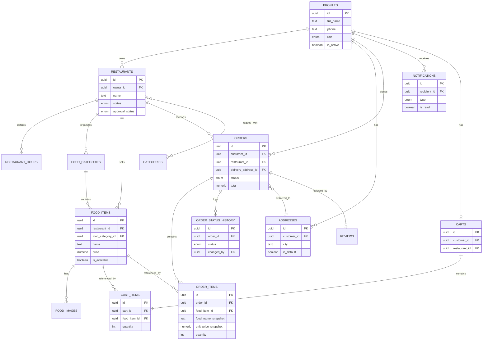

---

## 9. System Architecture Diagram

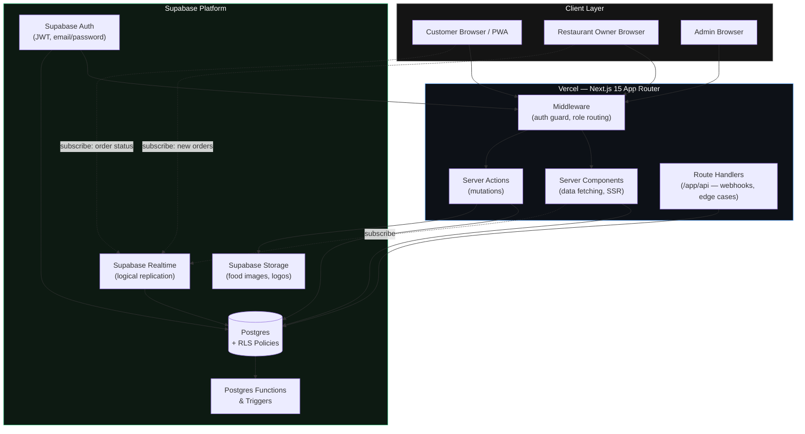

**Key architectural decisions:**

- **No custom backend server.** Next.js Server Components/Server Actions call Supabase directly (via the server-side Supabase client using the user's JWT), so RLS is the actual authorization boundary — not application code. This removes an entire class of "backend forgot to check permissions" bugs.
- **Realtime is subscription-based, not polling.** The restaurant dashboard subscribes to a Postgres changes channel filtered to `orders` rows where `restaurant_id = current_restaurant`. Supabase Realtime streams this over websockets, so "instant" new-order notification requires zero custom infrastructure.
- **Route Handlers are reserved for cases Server Actions can't cleanly cover** — e.g., a future payment webhook, or serving signed download links — keeping the MVP's actual surface area small.

---

## 10. Component Diagram

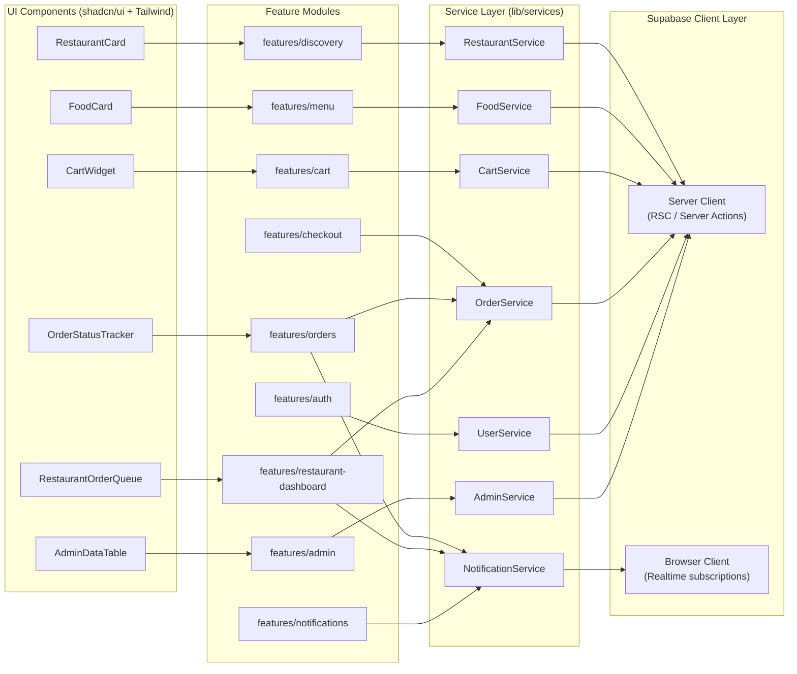


---

## 11. Sequence Diagrams

### 11.1 Order Placement → Restaurant Notification

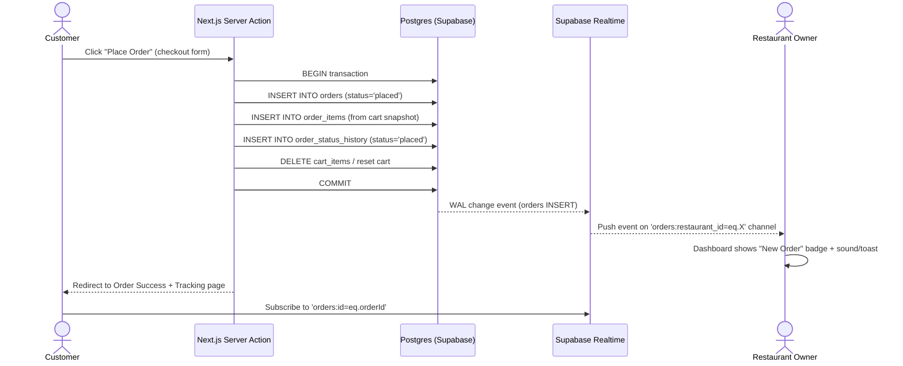

### 11.2 Order Accept / Reject and Status Progression

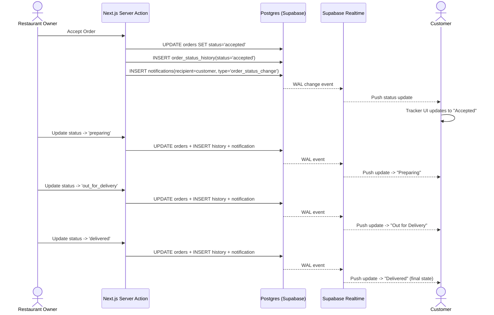

### 11.3 Restaurant Onboarding (Admin Approval)

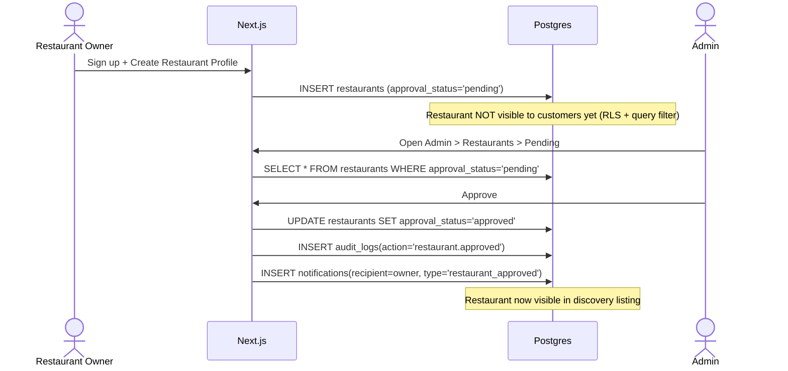

---

## 12. Authentication Flow

LROP uses **Supabase Auth** (email/password for MVP) with a single `auth.users` table and a `profiles` table holding the app-specific `role` column. Role-based routing is enforced at two layers: **Next.js Middleware** (UX-level redirect) and **RLS policies** (actual security boundary).

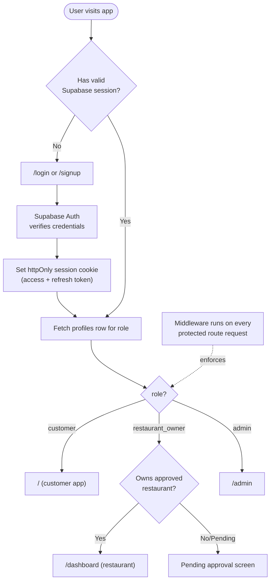

**Notes:**

- Signup for `restaurant_owner` creates the `profiles` row with `role='restaurant_owner'` and prompts restaurant profile creation immediately after; the restaurant starts with `approval_status='pending'` and is invisible to customers until an admin approves it.
- `admin` accounts are **not self-signup** — seeded manually via Supabase dashboard/SQL, or created by an existing admin through an admin-only invite flow. This is a deliberate MVP simplification.
- Session refresh is handled by the Supabase SSR helper (`@supabase/ssr`) inside Next.js Middleware, keeping cookies valid across server/client boundaries.
- Middleware performs **coarse** role routing only (redirect a customer away from `/admin`); **fine-grained** authorization (e.g., "can this owner edit this food item") is always re-verified by RLS at the database layer, since middleware/UI checks alone are not a security boundary.

---

## 13. Order Workflow

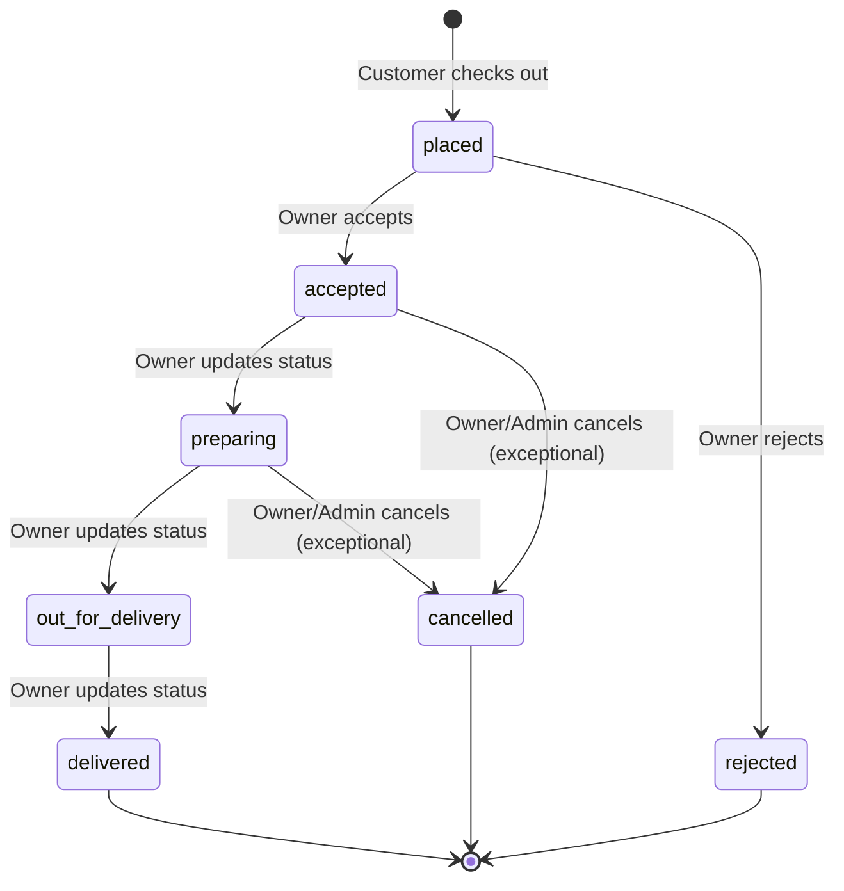

**Rules enforced at the database layer (via trigger/check, not just UI):**

- Only forward transitions are legal; e.g., `delivered → preparing` is rejected by a `BEFORE UPDATE` trigger on `orders` that validates the transition against an allowed-transitions map.
- Only the owning restaurant's owner (or admin) may transition an order — enforced by RLS `UPDATE` policy on `orders` (`restaurant_id` must match a restaurant owned by `auth.uid()`).
- Every transition writes a row to `order_status_history`, which is the source of truth the customer-facing tracker reads from (rather than trusting only the current `orders.status` value) — this makes the tracker resilient to any status write that doesn't also log history, and gives a full timeline for support/audit purposes.
- `rejected` requires a `rejection_reason` (enforced in the Server Action, surfaced to the customer).

---

## 14. Notification Workflow

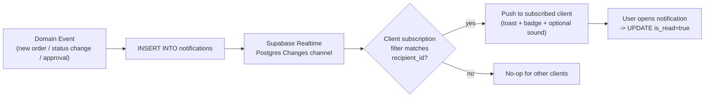

- Notifications are **row-based**, not a push-notification service (push notifications are Phase 2). The `notifications` table is the single source of truth; Realtime just streams inserts to the relevant client.
- Each client (customer tab, restaurant dashboard tab) subscribes to `notifications:recipient_id=eq.<current_user_id>` — RLS additionally ensures a user can only ever `SELECT` their own notifications, so even a misconfigured filter can't leak another user's notifications.
- Unread count badge is derived client-side from `SELECT count(*) WHERE is_read=false`, refreshed on new Realtime events and on page load.


---

## 15. Folder Structure

```
lrop/
├── app/
│   ├── (marketing)/
│   │   └── page.tsx                     # Landing page
│   ├── (customer)/
│   │   ├── restaurants/
│   │   │   ├── page.tsx                 # Restaurant listing
│   │   │   └── [restaurantId]/
│   │   │       ├── page.tsx             # Restaurant details + menu
│   │   │       └── food/[foodId]/page.tsx
│   │   ├── cart/page.tsx
│   │   ├── checkout/page.tsx
│   │   ├── orders/
│   │   │   ├── page.tsx                 # Order history
│   │   │   └── [orderId]/page.tsx       # Order tracking
│   │   └── layout.tsx
│   ├── (restaurant)/
│   │   └── dashboard/
│   │       ├── page.tsx                 # Dashboard home
│   │       ├── orders/page.tsx
│   │       ├── menu/
│   │       │   ├── categories/page.tsx
│   │       │   └── items/page.tsx
│   │       ├── settings/page.tsx
│   │       └── layout.tsx
│   ├── (admin)/
│   │   └── admin/
│   │       ├── page.tsx
│   │       ├── restaurants/page.tsx
│   │       ├── orders/page.tsx
│   │       ├── users/page.tsx
│   │       ├── settings/page.tsx
│   │       └── layout.tsx
│   ├── (auth)/
│   │   ├── login/page.tsx
│   │   └── signup/page.tsx
│   ├── api/
│   │   └── webhooks/                    # reserved for Phase 2 payment webhooks
│   ├── layout.tsx                       # Root layout
│   └── globals.css
├── components/
│   ├── ui/                              # shadcn/ui primitives (button, card, dialog...)
│   └── shared/                          # cross-feature composites (Navbar, Footer, EmptyState)
├── features/
│   ├── discovery/                       # restaurant listing, search, filters
│   ├── menu/                            # food browsing, food detail
│   ├── cart/                            # cart UI + logic
│   ├── checkout/                        # address selection, order placement
│   ├── orders/                          # order history, tracking UI
│   ├── restaurant-dashboard/            # owner-facing order queue, menu mgmt
│   ├── admin/                           # admin-facing management screens
│   ├── auth/                            # login/signup forms
│   └── notifications/                   # notification bell, toast handling
├── hooks/
│   ├── use-cart.ts
│   ├── use-realtime-orders.ts
│   └── use-current-profile.ts
├── lib/
│   ├── supabase/
│   │   ├── server.ts                    # server-side Supabase client (RSC/Server Actions)
│   │   ├── client.ts                    # browser Supabase client (Realtime)
│   │   └── middleware.ts                # session refresh helper for middleware.ts
│   ├── validation/                      # zod schemas per domain
│   └── utils/                           # formatting, date helpers, price helpers
├── services/                            # thin domain services wrapping Supabase queries
│   ├── restaurant.service.ts
│   ├── food.service.ts
│   ├── cart.service.ts
│   ├── order.service.ts
│   ├── notification.service.ts
│   ├── user.service.ts
│   └── admin.service.ts
├── actions/                             # Next.js Server Actions (mutations), thin wrappers over services
│   ├── cart.actions.ts
│   ├── checkout.actions.ts
│   ├── order.actions.ts
│   ├── restaurant.actions.ts
│   └── admin.actions.ts
├── types/
│   ├── database.types.ts                # generated via `supabase gen types typescript`
│   └── domain.types.ts                  # app-level types built on generated types
├── store/
│   └── cart-store.ts                    # lightweight client state (e.g., Zustand) for optimistic cart UI
├── middleware.ts                        # auth/session + role-based route guarding
├── public/
└── supabase/
    ├── migrations/                      # SQL migration files (source of truth for schema)
    └── seed.sql
```

**Responsibility of each top-level folder:**

| Folder | Responsibility |
|---|---|
| `app/` | Routing only (App Router). Route groups `(customer)`, `(restaurant)`, `(admin)`, `(auth)` separate concerns without affecting URL structure. Pages compose feature components; pages themselves stay thin. |
| `components/ui` | Unmodified/lightly-themed shadcn/ui primitives — no business logic. |
| `components/shared` | Composite components used across ≥2 features (Navbar, Footer). |
| `features/` | Feature-scoped UI + local hooks/logic. Each feature folder owns its own components, not shared globally unless promoted to `components/shared`. |
| `hooks/` | App-wide reusable hooks (cart, realtime subscriptions, current-user profile). |
| `lib/supabase` | The only place Supabase clients are instantiated — enforces one server client pattern and one browser client pattern platform-wide. |
| `lib/validation` | Zod schemas shared between client forms and Server Actions (single source of validation truth). |
| `services/` | Pure functions wrapping Supabase queries per domain — no React, testable in isolation, the "logical API layer" referenced in Section 16. |
| `actions/` | Server Actions — the only place mutations are triggered from the UI; each action validates input (via `lib/validation`) then calls a `services/` function. |
| `types/` | Single source of DB types (auto-generated) plus derived domain types. |
| `store/` | Minimal client-side state for optimistic UI (e.g., cart quantity while a Server Action is in flight). |
| `middleware.ts` | Session refresh + coarse role-based redirects. |
| `supabase/migrations` | Versioned SQL — the database's real source of truth, checked into git. |

---

## 16. API / Service Layer Design

Supabase removes the need for a traditional REST/GraphQL backend, but a **logical service layer** is still essential: it keeps Supabase query logic out of components, gives one place to add caching/validation, and makes the codebase swappable later (e.g., if a dedicated backend is ever introduced).

| Service | Responsibility | Key Methods |
|---|---|---|
| **RestaurantService** | Restaurant CRUD, discovery queries, timing/status management | `listApproved()`, `getById()`, `search(query)`, `updateStatus()`, `updateHours()` |
| **FoodService** | Food category + food item CRUD, image upload orchestration, stock toggling | `listByRestaurant()`, `createItem()`, `updateItem()`, `toggleAvailability()`, `uploadImage()` |
| **CartService** | Server-persisted cart mutations, restaurant-scoping enforcement | `getOrCreateCart()`, `addItem()`, `updateQuantity()`, `removeItem()`, `clear()` |
| **OrderService** | Order placement, status transitions, history, tracking reads | `placeOrder(cart, address)`, `acceptOrder()`, `rejectOrder(reason)`, `updateStatus()`, `getTrackingTimeline()`, `listByCustomer()`, `listByRestaurant()` |
| **NotificationService** | Notification creation + read-state, subscription helpers | `create()`, `markRead()`, `listUnread()` |
| **UserService** | Profile management, role lookups | `getProfile()`, `updateProfile()`, `getRole()` |
| **AdminService** | Restaurant approval, user management, platform settings, audit logging | `approveRestaurant()`, `suspendRestaurant()`, `listAllOrders()`, `updateSetting()`, `logAudit()` |

**Design conventions:**

- Every service function accepts an already-authenticated Supabase server client instance (dependency injection) — services never instantiate their own client, which keeps them testable and keeps RLS as the actual enforcement point (a service never uses the Supabase service role key on the user's behalf).
- Services return typed domain objects (from `types/domain.types.ts`), not raw Supabase responses — insulates the rest of the app from schema-shape changes.
- All writes go through Server Actions → Services; no direct `supabase.from(...).insert()` calls from client components (except narrowly for Realtime subscription reads, which are read-only).
- Only `AdminService` may use elevated (service-role) queries, and only for specific admin-only operations (e.g., cross-tenant reads for the platform dashboard) that RLS is intentionally structured to deny to normal `authenticated` users — this keeps the service-role key usage minimal and auditable.


---

## 17. Dashboard Design

### 17.1 Customer Dashboard ("My Account" area)

**Navigation:** Home / Restaurants / Cart / Orders / Profile

| Page | Components |
|---|---|
| Restaurant Listing | Search bar, Category filter chips, `RestaurantCard` grid, Open/Closed badge |
| Restaurant Details | Header (banner, name, status, timing), Category tabs, `FoodCard` list |
| Food Details | Image, description, price, veg/non-veg tag, quantity stepper, Add to Cart |
| Cart | Line items (`CartItemRow`), quantity controls, subtotal, Checkout CTA |
| Checkout | Address selector/form, Order summary, COD confirmation, Place Order CTA |
| Order Success | Confirmation card, "Track Order" CTA |
| Order Tracking | `OrderStatusTracker` (stepper widget), live status via Realtime, item summary |
| Order History | Table/list of past orders, filter by status, "Reorder" (future) |

### 17.2 Restaurant Owner Dashboard

**Navigation:** Dashboard / Orders / Menu (Categories, Items) / Settings

| Page | Components |
|---|---|
| Dashboard Home | Stat cards (Today's Orders, Pending, Revenue Today), Recent Orders table |
| Orders (Live Queue) | `RestaurantOrderQueue` — kanban-style columns (Placed / Accepted / Preparing / Out for Delivery), Accept/Reject buttons, customer detail drawer |
| Order History | Filterable table (date range, status), CSV export (future) |
| Menu > Categories | Sortable list, add/edit/delete category form |
| Menu > Items | Data table (image thumbnail, name, category, price, stock toggle), add/edit item form with image upload widget |
| Settings > Profile | Restaurant name/description/logo/banner form |
| Settings > Timing | Weekly hours grid editor |
| Settings > Status | Open / Closed / Holiday toggle (prominent, top of dashboard too) |

### 17.3 Super Admin Dashboard

**Navigation:** Dashboard / Restaurants / Orders / Users / Categories / Settings

| Page | Components |
|---|---|
| Dashboard Home | Platform stat cards (Total Restaurants, Pending Approvals, Total Orders Today, Active Users), trend chart (future) |
| Restaurants | `AdminDataTable` with filters (pending/approved/suspended), Approve/Suspend/Delete actions |
| Orders | Cross-restaurant order table, filters (restaurant, status, date) |
| Users | User table, role filter, deactivate action |
| Categories | Global category CRUD (used for restaurant tagging) |
| Settings | Platform config form (support contact, banners), banner image manager |

**Shared dashboard widgets:** `StatCard`, `AdminDataTable` (sortable/filterable, pagination), `StatusBadge`, `ConfirmDialog` (for destructive actions), `EmptyState`, `LoadingSkeleton`.

---

## 18. Security Design

| Area | Approach |
|---|---|
| **Authentication** | Supabase Auth (email/password), httpOnly cookies via `@supabase/ssr`, session refresh in middleware |
| **Authorization / RBAC** | Three roles stored in `profiles.role`. Coarse routing enforced in Middleware; **actual enforcement is RLS on every table** |
| **Row Level Security (RLS)** | Enabled on **every** table. Representative policies below (Section 18.1) |
| **Input Validation** | Zod schemas in `lib/validation/`, shared between client forms and Server Actions; Server Actions never trust client-side validation alone |
| **SQL Injection Prevention** | No raw SQL string concatenation anywhere in the app layer — all queries go through the Supabase client's parameterized query builder or typed Postgres functions |
| **Rate Limiting** | Vercel Edge Middleware rate limiting (e.g., via Upstash Redis or Vercel's built-in) on auth endpoints and order-placement Server Action to prevent abuse/spam orders |
| **Image Validation** | Client + server-side MIME/type check (jpeg/png/webp only), max file size (e.g., 5MB), re-encoded or validated before upload to Storage; Storage bucket policies restrict upload paths to `restaurant_id`-scoped folders owned by the requester |
| **File Upload Security** | Uploads go to Supabase Storage with bucket-level RLS-equivalent policies; public buckets serve only optimized/derived images, never arbitrary uploads directly |
| **Secrets/Env Vars** | `SUPABASE_SERVICE_ROLE_KEY` never exposed to client, used only in trusted server contexts (`AdminService`); all secrets in Vercel Environment Variables, never committed to git |
| **Transport Security** | HTTPS enforced everywhere (Vercel default); Supabase connections are TLS by default |
| **Auditability** | `audit_logs` table for admin actions; `order_status_history` for order-domain actions |

### 18.1 Representative RLS Policies

```sql
-- profiles: users can read/update only their own profile
create policy "profiles_select_own"
  on profiles for select
  using (auth.uid() = id);

create policy "profiles_update_own"
  on profiles for update
  using (auth.uid() = id);

-- restaurants: publicly readable only if approved; owner can read/update their own regardless of status
create policy "restaurants_public_read_approved"
  on restaurants for select
  using (approval_status = 'approved');

create policy "restaurants_owner_read_own"
  on restaurants for select
  using (owner_id = auth.uid());

create policy "restaurants_owner_update_own"
  on restaurants for update
  using (owner_id = auth.uid());

-- food_items: public can read only available items of approved restaurants; owner has full CRUD on own restaurant's items
create policy "food_items_public_read"
  on food_items for select
  using (
    exists (
      select 1 from restaurants r
      where r.id = food_items.restaurant_id
        and r.approval_status = 'approved'
    )
  );

create policy "food_items_owner_crud"
  on food_items for all
  using (
    exists (
      select 1 from restaurants r
      where r.id = food_items.restaurant_id
        and r.owner_id = auth.uid()
    )
  );

-- orders: customer sees only their own orders; owner sees only orders for their restaurant
create policy "orders_customer_read_own"
  on orders for select
  using (customer_id = auth.uid());

create policy "orders_owner_read_own_restaurant"
  on orders for select
  using (
    exists (
      select 1 from restaurants r
      where r.id = orders.restaurant_id
        and r.owner_id = auth.uid()
    )
  );

create policy "orders_owner_update_status"
  on orders for update
  using (
    exists (
      select 1 from restaurants r
      where r.id = orders.restaurant_id
        and r.owner_id = auth.uid()
    )
  );

-- admin: full read across all tables via role check (applied consistently per table)
create policy "admin_full_read"
  on orders for select
  using (
    exists (
      select 1 from profiles p
      where p.id = auth.uid() and p.role = 'admin'
    )
  );
```

### 18.2 Database-Level Order Transition Guard

```sql
create or replace function enforce_order_status_transition()
returns trigger as $$
begin
  if old.status = 'delivered' or old.status = 'cancelled' or old.status = 'rejected' then
    raise exception 'Order is in a terminal state and cannot be updated';
  end if;

  if not (
    (old.status = 'placed' and new.status in ('accepted','rejected'))
    or (old.status = 'accepted' and new.status in ('preparing','cancelled'))
    or (old.status = 'preparing' and new.status in ('out_for_delivery','cancelled'))
    or (old.status = 'out_for_delivery' and new.status = 'delivered')
  ) then
    raise exception 'Invalid order status transition: % -> %', old.status, new.status;
  end if;

  insert into order_status_history (order_id, status, changed_by)
  values (new.id, new.status, auth.uid());

  return new;
end;
$$ language plpgsql security definer;

create trigger trg_order_status_transition
  before update of status on orders
  for each row
  when (old.status is distinct from new.status)
  execute function enforce_order_status_transition();
```


---

## 19. Deployment Architecture

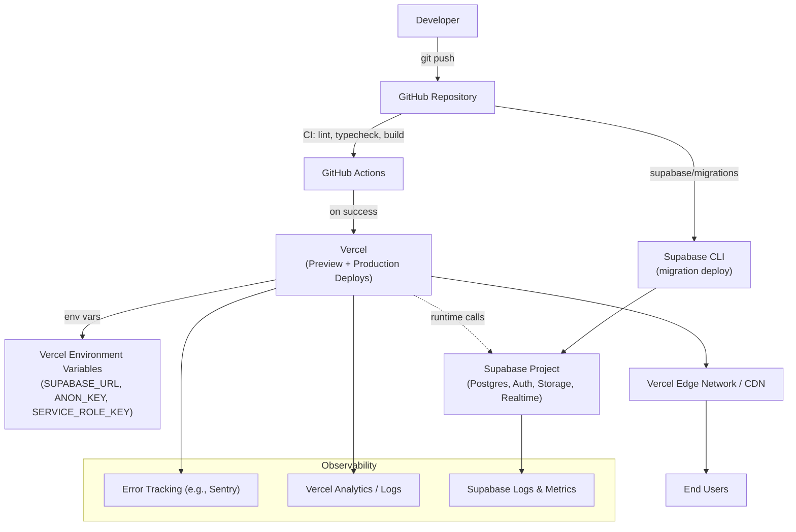

**Environments:** `local` (Supabase CLI local stack) → `preview` (Vercel preview deploys per PR, pointed at a Supabase staging project) → `production` (Vercel production, production Supabase project). Database migrations are version-controlled SQL files applied via the Supabase CLI as a CI step before/alongside the app deploy, never applied manually against production.

**Error Handling & Logging:**
- Server Actions wrap Supabase calls in try/catch, returning typed `{ data, error }` results consumed by the UI (never throwing raw errors to the client).
- Unhandled exceptions are captured by an error-tracking SDK (e.g., Sentry) with request context (user id, role, route) attached.
- Structured logs (JSON) for key domain events (order placed, status changed, restaurant approved) support later analytics without needing a separate event pipeline in MVP.

**Monitoring:**
- Vercel's built-in uptime/latency monitoring for the app.
- Supabase's built-in dashboard for DB CPU/connections, Realtime connection counts, and Storage usage.
- A lightweight external uptime check (e.g., a cron-based health-check hitting `/api/health`) to catch full-platform outages independent of Vercel's own status.

---

## 20. Scaling Strategy

| Dimension | MVP Approach | Scale-Up Path |
|---|---|---|
| **Database connections** | Supabase's built-in connection pooler (PgBouncer, transaction mode) | Increase pool size / move to a larger Supabase compute tier as restaurant/order volume grows |
| **Read load (discovery)** | Direct Postgres reads with indexes on `restaurants(approval_status, city)`, `food_items(restaurant_id, is_available)` | Add materialized views or a cache layer (e.g., Vercel Data Cache / Redis) for high-traffic listing pages if needed |
| **Realtime connections** | Supabase Realtime scales per-project; MVP traffic (tens of restaurants, low thousands of customers) is well within default limits | Move to Supabase's higher tiers; shard Realtime channels more granularly if needed |
| **Static/edge delivery** | Vercel Edge Network serves all pages/assets globally by default | No change needed at MVP scale; ISR/edge caching can be tuned for restaurant listing pages |
| **Image storage/delivery** | Supabase Storage with public CDN-backed buckets for menu/restaurant images | Add on-the-fly image transformation/optimization (Supabase Image Transformations or a dedicated image CDN) as catalog grows |
| **Order write throughput** | Single-row inserts per order are trivial at this scale (hundreds of orders/day town-wide) | Not a near-term concern; Postgres comfortably handles orders of magnitude more before requiring changes |
| **Multi-tenancy isolation** | RLS-based logical isolation, all tenants share one Postgres database | Sufficient indefinitely for a single-town/region platform; only revisit if expanding to many independent regional deployments |
| **Search** | Simple `ILIKE`/trigram search on restaurant/food names | Move to Postgres full-text search (`tsvector`) or a dedicated search service (e.g., Meilisearch/Algolia) if catalog and query volume grow significantly |

---

## 21. Future Improvements (Roadmap)

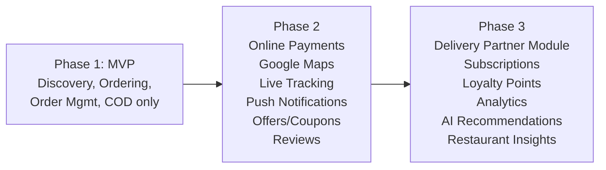

- **Phase 2** primarily extends the existing schema (`payment_method` enum gains values, `coupons`/`reviews` tables move from reserved to active, `addresses` gains `lat`/`lng` for map integration) rather than requiring a redesign.
- **Phase 3** introduces genuinely new domains (delivery-partner assignment, subscriptions, loyalty ledger) that will need new tables and likely a background-job mechanism (Supabase Edge Functions + cron) not present in the MVP.

---

## 22. Risks

| Risk | Impact | Mitigation |
|---|---|---|
| Restaurant owners are non-technical and may resist adopting a dashboard | Low platform adoption | Keep owner dashboard minimal (Section 17.2 scope); provide onboarding walkthrough; MVP intentionally has a shallow learning curve |
| No payment gateway means no revenue-at-order-time verification; customers could place orders and not honor COD | Restaurant frustration, churn | Out of scope to solve technically in MVP; mitigate via restaurant-side ability to reject orders and (future) customer reliability scoring |
| Realtime reliability depends entirely on Supabase Realtime uptime | Missed/delayed order notifications | Fallback polling (e.g., refetch on dashboard focus/interval) as a safety net even though Realtime is primary |
| Single Postgres database is a single point of failure for the whole platform | Full outage if DB has issues | Rely on Supabase's managed backups/HA; document a manual failover/restore runbook |
| Restaurant owners might not keep menu/stock status updated | Customers order unavailable items, real-world order rejected on call/kitchen side | `is_available` toggle is prominent in dashboard; future: auto-flag items untouched for N days |
| RLS policy misconfiguration could leak cross-tenant data | Serious security/privacy incident | Policies reviewed in Section 18.1 are the canonical reference; require RLS policy tests before any schema change ships |
| Admin approval step could bottleneck restaurant onboarding if admin is unavailable | Restaurants can't go live | Keep admin dashboard simple enough that this is a low-friction, fast action; consider auto-approval toggle for trusted onboarding channels later |

---

## 23. Assumptions

- The platform operates within a single town/region for the MVP — no multi-region or multi-currency concerns.
- All restaurants already have functioning in-house delivery staff; the platform makes no delivery-time guarantees or SLAs.
- Cash on Delivery is culturally/operationally acceptable to both customers and restaurants in this market for the MVP period.
- Customers and restaurant owners have basic smartphone/browser literacy.
- Restaurant owners will self-manage their own menu data entry (no data-entry service provided in MVP).
- A single Super Admin (or small trusted team) is sufficient for MVP-stage restaurant approvals and platform moderation.
- Order volume during MVP (single town) stays within the comfortable default limits of Supabase's free/starter compute tiers.
- No legal/regulatory requirement (e.g., food safety certification display) is mandated for MVP launch; can be added to the restaurant profile schema later if required.

---

## 24. MVP Timeline

Indicative timeline for a small team (2–3 engineers) or a focused solo engineer; assumes stack familiarity.

| Week | Milestone |
|---|---|
| 1 | Project setup: Next.js 15 + Supabase project + Vercel pipeline; DB schema migrations (Section 7) + RLS policies (Section 18.1) |
| 2 | Auth flow (signup/login, role-based middleware), Profile management |
| 3 | Restaurant onboarding + Admin approval flow; Restaurant profile/timing/status management |
| 4 | Food category & food item management (CRUD + image upload) |
| 5 | Customer discovery (listing, search, restaurant details, food details) |
| 6 | Cart (server-persisted) + Checkout (address + COD) + Order placement |
| 7 | Realtime order notifications (restaurant side) + Order accept/reject + status progression |
| 8 | Customer order tracking + order history; Notification system end-to-end |
| 9 | Restaurant dashboard polish (sales summary, order queue UX); Admin dashboard (orders/users/categories/settings) |
| 10 | Security hardening pass (RLS review, rate limiting, input validation audit), error tracking/monitoring setup, QA + bug fixing, deploy to production |

---

## 25. Engineering Best Practices

- **Strict TypeScript** across the codebase; `types/database.types.ts` regenerated via `supabase gen types typescript` on every schema migration and committed to git.
- **Migrations-as-code**: all schema changes (including RLS policies and triggers) live in `supabase/migrations/`, applied via CI — never hand-edited in the Supabase dashboard for anything beyond local experimentation.
- **Server Actions validate before they mutate**: every action runs its Zod schema first, returns typed `{data, error}`, never trusts client state.
- **Services stay framework-agnostic**: `services/` functions take a Supabase client + typed args and return typed data — no Next.js-specific imports, keeping them unit-testable.
- **RLS is the real authorization layer**: UI-level role checks are UX conveniences, never treated as sufficient authorization on their own; every new table ships with RLS enabled and policies reviewed against Section 18.1 patterns before merge.
- **Optimistic UI only where safe to reconcile**: cart quantity changes are optimistic (instant feedback, reconciled by Server Action response); order status transitions are never optimistic (always reflect confirmed DB state, since correctness matters more than snappiness there).
- **Consistent error surfaces**: a shared `ActionResult<T>` type (`{ success: true, data: T } | { success: false, error: string }`) used by every Server Action so the UI has one pattern for handling failures.
- **Component boundaries**: Server Components fetch data by default; a component becomes a Client Component only when it needs interactivity, browser APIs, or a Realtime subscription — minimizing client JS shipped.
- **Code review checklist** (for every PR touching data access): Does this table/column need an RLS policy update? Does this mutation validate input? Does this Realtime subscription filter correctly by tenant/user? Is there a migration file for any schema change?
- **No secrets in client bundles**: enforced by convention (service role key only imported in `services/admin.service.ts`, which is server-only) and periodic manual audit of `NEXT_PUBLIC_*` env usage.

---

*End of document.*
